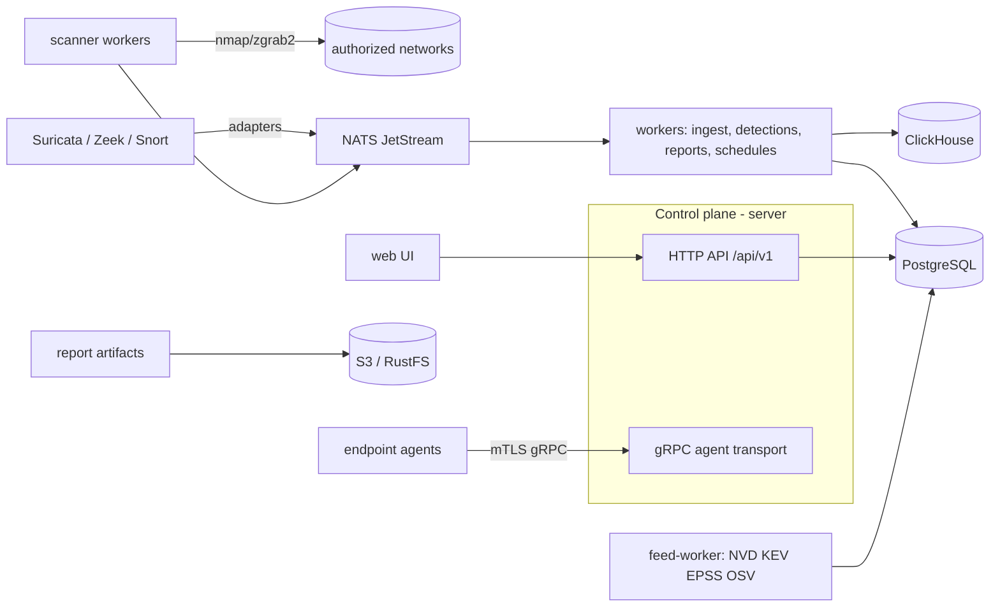

# Aegis Security Platform

A self-hostable, open-source **defensive** cybersecurity platform for *authorized* networks: asset discovery, network topology, vulnerability management with exploitability intelligence (CISA KEV / FIRST EPSS), endpoint inventory agents, network-sensor telemetry (Suricata / Zeek / Snort 3), behavioral detections, risk scoring with transparent explanations, professional reports — in one coherent platform with a unified data model.

> **Authorized use only.** Aegis operates exclusively against networks, devices and systems the customer explicitly owns or is authorized to assess. It does not implement exploitation, credential brute forcing, persistence, malware deployment, or unauthorized access. Default scanning policy is conservative and non-intrusive; elevated capabilities require explicit permission, confirmation, audit logging and a kill switch.

## Feature highlights

- **Discovery & inventory** — multi-technique host discovery, TCP/UDP port scanning, service/version and OS fingerprinting via Nmap/ZGrab2 adapters (never reimplemented), device classification with confidence and provenance for every fingerprint.
- **Asset correlation** — logical assets identified by strong/medium/weak identity weights (agent id, MAC, serial, hostname, IP); IP reuse never silently merges devices.
- **Vulnerability intelligence** — continuously synchronized local CVE index (NVD, CISA KEV, FIRST EPSS, OSV) with full provenance; explainable matching engine (`EXACT_CPE`, `CPE_RANGE`, `PACKAGE_VERSION`, heuristic-potential) that never pretends unknown versions are confirmed.
- **Risk engine** — environmental 0–100 score blending CVSS, KEV, EPSS, exposure, criticality and compensating controls; every score ships with its explanation.
- **Endpoint agents** — one small Go binary for Windows/Linux/macOS; mTLS device identity, typed tasks only (no remote shell), explicit privacy tiers, offline buffering.
- **Network sensors** — Suricata EVE, Zeek JSON and Snort 3 adapters normalize into a common event model stored in ClickHouse with time-bounded retention.
- **Detections** — typed threshold / temporal / entity-aggregation rules with dedup windows, Sigma-compatible metadata, statistical baselines (anomaly ≠ confirmed malicious).
- **Reports** — executive, technical, inventory and scan-comparison reports rendered asynchronously to HTML/PDF/CSV/JSON in object storage.
- **UI** — dense, dark-first, keyboard-driven (⌘K command palette, `g`-chords) operator console.
- **Ops** — Docker Compose and Kubernetes/Helm deployments, health/readiness, Prometheus metrics, OpenTelemetry hooks, migrations, CI.

## Quickstart (Docker Compose)

```bash
git clone https://github.com/FlameInTheDark/aegis.git
cd aegis
docker compose -f deploy/compose/docker-compose.yml up -d
# first boot applies migrations, seeds demo data (AEGIS_DEMO_MODE=true)
open http://localhost:3000
```

Default demo credentials (change in production):

| | |
|---|---|
| URL | http://localhost:3000 |
| Email | `admin@aegis.local` |
| Password | `aegis-demo-admin-2026` |

The compose deployment includes Postgres, Redis, NATS (JetStream), ClickHouse, RustFS, the control plane (`server`), background `worker`, `feed-worker`, `scanner` and the web UI. Optional profiles: `--profile monitoring` (Prometheus) and `--profile sensors` (Suricata skeleton).

## Architecture at a glance



Deeper documents: [ARCHITECTURE](docs/ARCHITECTURE.md) · [SCANNER](docs/SCANNER.md) · [AGENT](docs/AGENT.md) · [VULNERABILITY-FEEDS](docs/VULNERABILITY-FEEDS.md) · [DETECTION-ENGINE](docs/DETECTION-ENGINE.md) · [DATA-MODEL](docs/DATA-MODEL.md) · [API](docs/API.md) · [SECURITY-MODEL](docs/SECURITY-MODEL.md) · [THREAT-MODEL](docs/THREAT-MODEL.md) · [DEPLOYMENT](docs/DEPLOYMENT.md) · [OPERATIONS](docs/OPERATIONS.md) · [TROUBLESHOOTING](docs/TROUBLESHOOTING.md)

## Repository layout

```
cmd/            server, worker, scanner, agent, feed-worker binaries
internal/       domain, repositories, services, transports (no ORM; pgx + squirrel)
api/proto/      agent gRPC protocol (protobuf, buf-generated)
api/gen/        generated protobuf/gRPC code
migrations/     embedded PostgreSQL migrations + ClickHouse schema
web/            React + TypeScript + Vite frontend (dark, dense, keyboard-first)
deploy/         Dockerfiles, docker-compose, Kubernetes, Helm
configs/        documented service configuration files
scripts/        dev helpers, demo seed data, backup/restore
docs/           product & operations documentation
testdata/       synthetic feed/sensor fixtures used by tests
```

## Common commands

| Command | Purpose |
|---|---|
| `make build` | compile all Go binaries |
| `make test` | run Go test suite |
| `make lint` | gofmt + go vet |
| `make migrate-up` / `migrate-down` | apply / roll back schema migrations |
| `make run-server` / `run-worker` / `run-scanner` | run services locally |
| `cd web && npm run dev` | frontend dev server (proxies to :8080) |
| `cd web && npm run build` | production frontend bundle |

## Releases

Versions are cut by [semantic-release](.releaserc.json) from **Conventional Commits** on `main` — the git tag is the single source of truth, there is no version file in the tree:

- `fix:` / `perf:` → patch (v1.6.1)
- `feat:` → minor (v1.7.0)
- `feat!:` / `fix!:` with a `BREAKING CHANGE:` footer → major (v2.0.0)
- `docs:` / `chore:` / `refactor:` / `test:` → no release

Each release updates CHANGELOG.md, tags `vX.Y.Z` and attaches packaged source archives to the GitHub release. Pull-request commit messages are linted in CI.

## Security posture

- Argon2id password hashing, JWT access/refresh with revocable sessions, RBAC with five roles and resource-aware permissions.
- Tenant isolation enforced at API, service and repository layers — never only in the UI.
- Structured errors, request IDs, rate limits on auth/scan/report/ingest endpoints, request body caps, secret redaction in evidence and logs.
- Scanner argument construction is typed end-to-end: no user shell syntax ever reaches `exec`.
- Formal threat model in [docs/THREAT-MODEL.md](docs/THREAT-MODEL.md).

## Data licenses

Imported intelligence keeps its source attribution: NVD/CVE (NIST/CVE TOU), CISA KEV (public domain), FIRST EPSS (CC-BY), OSV (Apache-2.0 data). Nmap/ZGrab2/Nuclei/Suricata/Zeek/Snort are integrated as external tools under their own licenses — see [docs/VULNERABILITY-FEEDS.md](docs/VULNERABILITY-FEEDS.md).

## License

Apache-2.0 — see [LICENSE](LICENSE).
