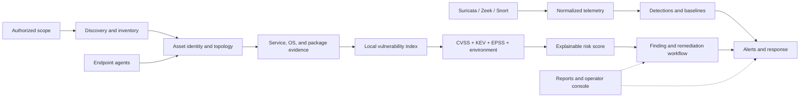
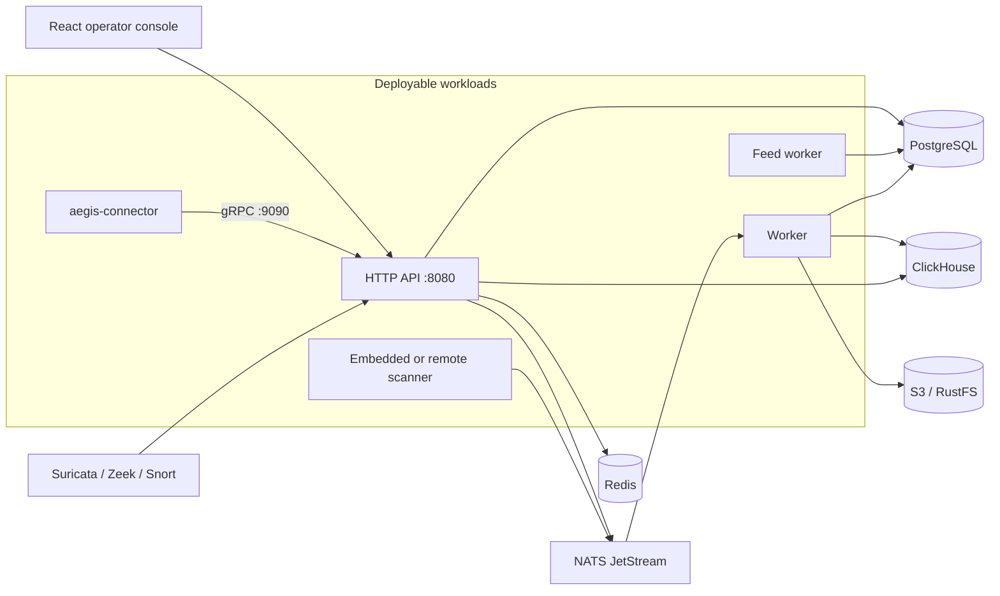

<div align="center">
  <h1>Æ Aegis</h1>
  <p><strong>Security operations with an evidence trail.</strong></p>
  <p>
    Discover every asset you are responsible for, understand its exposure,
    and turn raw security telemetry into decisions your team can defend.
  </p>
  <p>
    <a href="https://github.com/FlameInTheDark/aegis/actions/workflows/ci.yml"></a>
    <a href="https://github.com/FlameInTheDark/aegis/blob/main/LICENSE"></a>
    <a href="https://go.dev/"></a>
    <a href="https://react.dev/"></a>
  </p>
</div>

> [!WARNING]
> **Authorized use only.** Aegis is a defensive platform for networks, devices, and systems that you own or are explicitly authorized to assess. It does not exploit vulnerabilities, brute-force credentials, provide a remote shell, deploy malware, or establish persistence. Scanning and monitoring someone else’s environment may be illegal.

## What Aegis is

Aegis is a self-hosted security platform that brings **asset discovery, inventory, vulnerability management, endpoint visibility, network telemetry, detection, alerting, and reporting** into one coherent operating picture.

Most security tools produce isolated lists: a scanner knows about ports, an endpoint tool knows about packages, an IDS knows about events, and a vulnerability feed knows about CVEs. Aegis correlates those observations around a durable asset identity, preserves how each fact was learned, and explains why an issue received its risk score.

The result is a practical loop:

> **Discover → identify → enrich → prioritize → detect → explain → act**

It is designed for security teams, IT operators, consultants, and lab or branch environments that need control of their data and deployment rather than another opaque SaaS dashboard.

## The Aegis approach

| Principle | What it means in practice |
| --- | --- |
| **Evidence over guesses** | Fingerprints carry confidence and provenance. Unknown versions stay unknown; heuristic matches are labelled potential, never confirmed. |
| **One asset model** | Scanner observations, SSH inventory, endpoint inventory, services, packages, interfaces, findings, and metrics converge on the same asset record. |
| **Risk with context** | CVSS, KEV, EPSS, exposure, business criticality, endpoint visibility, and compensating controls remain separate signals and produce an explainable 0–100 score. |
| **Safe by default** | Conservative scan profiles, strict scope validation, typed command arguments, public-scope rejection, explicit elevated confirmation, and a scan kill switch. |
| **Operable anywhere** | Run the complete stack locally, place scanners near remote sites, enroll endpoints over the connector protocol, or deploy the workloads with Kubernetes and Helm. |
| **Useful after the alert** | Findings have workflow state, evidence, notes, suppressions, audit history, reports, and rediscovery actions—not just a severity badge. |

## From first packet to prioritized finding



## Capabilities

### 1. Discover the attack surface safely

Aegis uses external security engines through bounded adapters rather than reimplementing them. The built-in scanner is Nmap-backed when Nmap is available and has a deterministic simulated engine for demos, tests, and air-gapped evaluation. A simulated result is clearly reported—it never masquerades as a live scan.

**Scan profiles**

| Profile | Best for | Behavior |
| --- | --- | --- |
| `discovery_safe` | First look | Host discovery and a small TCP port set; quiet and conservative. |
| `inventory` | Normal inventory | Discovery, common TCP/UDP ports, service and OS detection. |
| `vulnerability_safe` | Exposure assessment | Inventory plus safe service probes and safe validation templates. |
| `active_validation` | Explicitly approved validation | More active probes; requires the elevated permission and an explicit confirmation. |
| `full_audit` | Deliberate deep assessment | Full port range; loud, slow, and clearly warned. |
| `trace` | Network mapping | Ping sweep and traceroute without a port scan. |
| `fingerprint` | Device classification | Lightweight service and OS fingerprinting for routers, servers, workstations, phones, IoT/OT and other asset types. |
| `ssh_inventory` | Agentless Linux inventory | Read-only package and host inventory over SSH, with per-host credentials and collection evidence. |

**Built-in safeguards and operator controls**

- Accepts IPs, CIDRs, ranges, and hostnames with strict parsing and expansion ceilings.
- Rejects localhost, metadata endpoints, shell metacharacters, and public targets by default; an explicit deployment setting is required for public scopes.
- Applies profile-specific target, packet-rate, runtime, stdout, and stderr limits.
- Builds typed argument arrays for `exec.CommandContext`; user input never becomes shell syntax.
- Captures engine version, exact scan configuration, exit status, stderr, phase progress, and bounded job logs.
- Supports cancellation between probes through a kill switch.
- Tracks changes such as `NEW_ASSET`, `SERVICE_OPENED`, and `VERSION_CHANGED`.
- Registers scanners by site and capability, so scheduled work is sent only to a reachable scanner.
- Can run scanners inside the stack, on a remote machine, or through an enrolled connector.

**Service, OS, and topology evidence**

Nmap service fingerprints become both service records and software inventory, including product, version, CPE candidates, and confidence. OS information can still be useful when raw OS probes are filtered because service fingerprints and service metadata are preserved as supporting evidence. Traces store parsed hops, probe method, raw output, confidence, and partial paths rather than silently claiming that an unreachable hop does not exist.

For SSH inventory, host keys are verified by default. Operators can pin an authorized key per host or scanner connection; accepting any host key is available only as an explicit lab-use option. Mixed-credential hosts are supported in one scan, credentials are redacted in read-back responses, and the scan records the exact read-only commands and per-host outcomes.

### 2. Build an inventory that stays coherent

Aegis treats an asset as the durable identity behind many observations—not as a temporary row created by the last scan.

- Correlates by strong identifiers such as device identity, machine ID, serial, and MAC; hostname/FQDN and IP are weaker evidence.
- Never silently merges devices only because an address was reused.
- Stores every observed interface, MAC, IPv4/IPv6 address, service, package, trace, fingerprint source, and confidence value.
- Classifies common infrastructure and endpoint types: routers, switches, firewalls, access points, cameras, servers, virtual machines, container hosts, workstations, printers, IoT/OT, NAS, mobile devices, hypervisors, and unknown assets.
- Organizes the environment into organizations, sites, networks, analyst-curated asset groups, tags, criticality, exposure, notes, and parent relationships.
- Shows scan-only and endpoint-enriched assets together, including the endpoint connection and last-seen status.
- Supports rediscovery, bulk operations, asset deletion, group membership management, and analyst notes.
- Renders a topology graph with hierarchy, group, site, and radial views; edge evidence can be inspected.

The web console exposes the inventory through **Assets**, **Asset details**, **Topology**, **Groups**, and **Connections**. An asset detail brings services, software, interfaces, findings, traces, recent events, notes, and endpoint performance into one place.

### 3. Turn vulnerability data into decisions

The `feed-worker` maintains a local, searchable vulnerability index. User requests do not depend on a live call to an external vulnerability API.

| Source | Adds |
| --- | --- |
| **NVD** | CVE records, CVSS, CPE applicability ranges, references, and incremental updates. |
| **CISA KEV** | Known-exploited-vulnerability prioritization context. |
| **FIRST EPSS** | Exploitation likelihood and percentile as a separate signal from severity. |
| **CVE List v5** | CVE Program records and CNA applicability/version bounds. |
| **OSV** | Ecosystem advisories for package inventories such as Go, npm, and PyPI. |
| **OVAL** | Optional distro-specific advisory matching for Debian, Ubuntu, RHEL-family, Alpine, and other configured sources. |

Feed synchronization is resumable, bounded, concurrent per source, retryable, and tracked as `healthy`, `running`, `stale`, `failed`, or `never_synced`. One upstream outage does not block the other feeds. Raw snapshots can be retained in object storage and normalized records keep source, source record, source version, and ingestion time.

**Matching is explicit about certainty**

| Match | Meaning | How Aegis treats it |
| --- | --- | --- |
| `EXACT_CPE` | Observed product and version match a pinned CPE | High-confidence confirmed match. |
| `CPE_RANGE` | Version falls inside a CPE applicability range | High-confidence range match. |
| `PACKAGE_VERSION` | Installed package falls inside an OSV range | Package-aware match. |
| `SERVICE_VERSION` | Service/banner version matches after normalization | Confidence depends on the evidence and grammar. |
| `HEURISTIC` | Product identity is plausible but the version is unknown | Potential only; never presented as confirmed. |

Version normalization understands Debian, RPM, APK, semantic, Python, OpenSSH, and upstream version domains. Raw values remain available beside normalized values, and finding evidence records the comparison domain, projected version, constraint, and both sides of the decision.

**Risk and triage**

- Calculates a 0–100 environmental risk score from technical severity, exploit likelihood, exposure, business impact, and compensating controls.
- Boosts prioritization for KEV membership and EPSS without confusing either signal with severity.
- Includes the contributing factors and a plain-language explanation with every score.
- Lets analysts update finding status, bulk-triage findings, add suppressions, inspect evidence, and audit each state change.
- Supports on-demand correlation after feed updates so existing inventory can be rematched without sending new packets.
- Includes a vulnerability search workbench with bounded, allowlisted actions and `shadow`, `augment`, and `fallback_only` modes. Preview is read-only and runs are durable and idempotent.

### 4. Add endpoint context without giving up control

The `aegis-connector` is one Go binary for external components. The same enrollment and configuration surface can operate an endpoint collector, a remote scanner, a collector connection, or a hybrid endpoint-plus-scanner process.

**Enrollment flow**

1. Create a connection in **Connections** and choose its kind and site.
2. Copy the one-time `aegis-connector --connect .../<token>` command.
3. The connector enrolls over gRPC and receives a long-lived secret and configuration.
4. An endpoint function generates its key locally, binds a device record, and receives a CA-signed device certificate when the agent CA is configured.
5. The connector heartbeats, watches for hot configuration changes, and starts only the enabled functions.

Enrollment tokens are hashed, single-use, expiring, revocable, and audited. Continued calls use connector credentials bound to the server-side connection; a client cannot choose another endpoint’s identity. Revoking a connection cuts off its data plane immediately.

**Endpoint collection**

- System and OS inventory: hostname, FQDN, platform, kernel, architecture, CPU, memory, uptime, serial, machine ID, and management address.
- Network inventory: interfaces, MACs, IPv4/IPv6 addresses, routes, DNS information, and sockets where enabled.
- Software inventory from native package sources on Linux, with raw and normalized versions.
- Security posture such as Secure Boot where the platform can report it; unsupported values remain `unknown` rather than being guessed.
- CPU, memory, load, uptime, and per-interface network performance samples in ClickHouse, with batching, bounded offline buffering, graceful shutdown flushing, and a 30-day default retention tier.
- Privacy tiers (`basic`, `standard`, `full`) and capability switches for software, network, posture, process, and local scan collection.
- Typed tasks such as inventory refresh, software inventory, network inventory, security posture, local configuration checks, diagnostics, and configuration sync—**never arbitrary command execution**.

Linux provides the richest collection surface. Windows and macOS provide platform-aware system information and best-effort collection where native data is available; the collector does not invent unsupported values. The connector can run continuously, reconnect with backoff, install as a systemd service, report status as JSON, and hot-reload configuration without a restart.

### 5. Ingest network telemetry and detect behavior

Aegis accepts normalized events from network sensors and endpoint streams, stores high-volume telemetry in ClickHouse, and evaluates detections through NATS JetStream workers.

**Supported sensor formats**

- **Suricata EVE JSON** — alerts, flows, DNS, HTTP, TLS, SSH, file info, anomalies, and unknown event types with bounded metadata preservation.
- **Zeek JSON** — connection, DNS, HTTP, SSL/TLS, SSH, SMTP, DHCP, notice, file, and other log paths with native fields retained.
- **Snort 3 JSON** — normalized IDS alert output.
- **Agent and platform events** — endpoint activity, asset changes, feed state, detection matches, and vulnerability index transitions.

**Detection rules** support:

- `single_event` — one matching event.
- `threshold` — a count or distinct-value threshold inside a time window.
- `temporal` — an ordered sequence of conditions.
- `entity_agg` — aggregation around an entity such as a host, account, or peer set.

Conditions are typed and support equality, membership, numeric comparisons, existence, containment, regular expressions, and nested payload metadata paths. Redis-backed deduplication turns repeated identical events into one explainable match with a count. Rules carry Sigma-style metadata and simple statistical baselines can flag rare peers, ports, or volume spikes. An anomaly remains labelled an anomaly; it is never silently upgraded to confirmed malicious activity.

Built-in examples include port scanning, SMB lateral movement, abnormal DNS volume, critical IDS alerts, and an experimental beacon-like cadence rule that is disabled by default.

### 6. Alert on the conditions that matter

**Detections** correlate security events. **Alerts** evaluate business-level transitions and endpoint metrics. Keeping those concepts separate prevents a raw IDS event from being confused with an operational incident.

Alert triggers can watch for:

- new assets, services, software, devices, findings, or detection matches;
- finding or scan state changes;
- feed failures, staleness, recovery, and vulnerability-index updates;
- agent state changes; and
- rolling device metrics such as CPU, memory, throughput, and load.

The alert engine provides activation and recovery durations, cooldowns, repeat behavior, hysteresis, missing-data policy, one open occurrence per trigger/fingerprint, and a durable lifecycle of firing → acknowledged → recovered or suppressed. The console always retains the occurrence even when no destination is configured.

Webhook destinations add HTTPS validation, bounded requests, HMAC-SHA256 signatures, retries with exponential backoff, dead-letter state, test delivery, and manual replay. The Alerts console includes active and historical occurrences, evidence snapshots, transition timelines, trigger preview/test, destination health, and delivery attempts.

### 7. Communicate with reports and a focused console

The operator console is dark-first, dense, keyboard-friendly, and built for investigation rather than decoration:

- **Overview** — posture at a glance.
- **Assets** — inventory, filters, risk, exposure, criticality, findings, agents, groups, and sites.
- **Topology** — network graph, hierarchy, groups, sites, routes, and trace evidence.
- **Scans** — create, schedule, monitor, inspect logs, compare changes, and cancel jobs.
- **Vulnerabilities** — local CVE index, feed status, prioritization, search actions, and diagnostics.
- **Findings** — severity, evidence, workflow state, suppression, notes, and bulk triage.
- **Detections** — normalized matches with triage status.
- **Alerts** — occurrences, trigger rules, recovery, and destinations.
- **Events** — searchable/cursor-paginated platform and sensor activity.
- **Connections** — endpoint devices, scanners, collectors, enrollment, liveness, and hot configuration.
- **Reports** — queued report jobs and secure artifact downloads.
- **Settings** — organizations, sites, networks, users, roles, scan profiles, scanners, feeds, audit log, and retention.

The UI supports a command palette with `⌘K` and keyboard navigation chords such as `g a`, `g s`, `g v`, and `g e`. Scan logs, scan state, and notifications can stream through the authenticated WebSocket endpoint instead of waiting for a full-page refresh.

Reports are generated asynchronously and can include executive security posture, technical vulnerabilities, network inventory, topology, security events, asset risk, scan comparisons, site detail, or device detail. Output formats are **PDF, HTML, CSV, and JSON**, with artifacts stored in S3-compatible object storage.

## Security and tenancy

Aegis is built to keep security boundaries in the backend, not just in the UI.

- **Authentication:** Argon2id password hashing; short-lived access JWTs; HttpOnly, SameSite refresh cookies; server-side session revocation; refresh rotation, grace handling, and reuse detection.
- **Authorization:** organization-aware RBAC with `owner`, `administrator`, `security_analyst`, `operator`, and `viewer` roles plus resource permissions such as `scan:create`, `scan:elevated`, and `finding:write`.
- **Tenant isolation:** organization ownership is resolved from authenticated membership and applied in API, service, and repository queries.
- **Input defense:** parameterized PostgreSQL queries, strict JSON/body limits, rate limits on sensitive endpoints, SSRF screening, pagination floors, and no shell-built scan commands.
- **Evidence hygiene:** banner secrets are redacted, payload sizes are bounded, reports escape untrusted content, and CSV formula injection is neutralized.
- **Auditability:** logins, session and connector changes, enrollment, scans and elevated-scan reasons, scope changes, findings, reports, and administrative actions are recorded with actor, source, result, and request correlation.
- **Deployment hardening:** containers run non-root, the scanner receives only the `NET_RAW` capability by default, and secure HTTP headers/HSTS are applied in production.

> [!NOTE]
> The bundled development Compose deployment exposes the gRPC listener as plaintext because production deployments are expected to terminate TLS at a trusted ingress or load balancer. Do not publish the development configuration directly to an untrusted network; configure TLS, the agent CA, secrets, and connector address for production.

## Architecture in one view

Aegis is a modular monolith with independently deployable workers. Business capabilities stay together; network-bound work such as scanning, feed synchronization, and endpoint connections can scale independently.



| Component | Responsibility |
| --- | --- |
| **Server** | HTTP API, authentication, tenancy, gRPC connector/agent transport, WebSocket streaming, migrations, health, and metrics. |
| **Worker** | Telemetry ingestion, detection and alert evaluation, correlation jobs, scheduled scans, reports, retention, delivery, and housekeeping. |
| **Scanner** | Site-local or distributed scan execution, Nmap/traceroute integration, SSH inventory, topology observations, and scan logs. |
| **Feed worker** | NVD, KEV, EPSS, CVE List v5, OSV, and configured OVAL synchronization. |
| **Connector** | Endpoint collection, remote scanning, collector integration, heartbeats, typed tasks, and hot configuration. |

| Store | Durable responsibility |
| --- | --- |
| **PostgreSQL** | Organizations, users, sites, assets, inventory, scans, findings, vulnerability records, detections, alerts, reports, and audit history. |
| **ClickHouse** | Security/network events, detection analytics, and endpoint performance metrics with TTL-based retention. |
| **NATS JetStream** | Versioned at-least-once event and job delivery. |
| **Redis** | Cache, rate limiting, locks, deduplication windows, and other ephemeral coordination. |
| **S3-compatible storage** | Report artifacts, optional raw feed snapshots, and other bounded evidence. |

## Quick start with Docker Compose

### Requirements

- Docker Engine with Docker Compose v2
- A machine that can reach the networks you are authorized to assess
- For native development: Go 1.27+, Node.js 22+, npm, and optionally `buf`

### Start the complete demo

```bash
git clone https://github.com/FlameInTheDark/aegis.git
cd aegis

# Build the images, start the full stack, apply migrations, and seed demo data.
make dev
```

The same deployment can be started directly with Docker Compose:

```bash
docker compose -f deploy/compose/docker-compose.yml up -d --build
docker compose -f deploy/compose/docker-compose.yml ps
```

Open **http://localhost:3000** when the services are healthy.

| Service | Address |
| --- | --- |
| Web console | http://localhost:3000 |
| HTTP API | http://localhost:8080 |
| API base | http://localhost:8080/api/v1 |
| gRPC connector/agent transport | `localhost:9090` |
| Prometheus metrics | http://localhost:9091/metrics |
| Readiness | http://localhost:8080/readyz |

The demo login is:

```text
Email:    admin@aegis.local
Password: aegis-demo-admin-2026
```

The default Compose environment is intentionally for local evaluation. Change the bootstrap password, JWT secret, object-storage credentials, agent CA, public URL, cookie settings, and connector address before using it anywhere else.

### What first boot does

1. The server applies the embedded PostgreSQL and ClickHouse migrations.
2. An initial organization, site, and owner account are bootstrapped.
3. With `AEGIS_DEMO_MODE=true`, synthetic assets, services, software, findings, detection matches, and security events populate the console. Demo records are marked as synthetic.
4. The local scanner registers for the first site unless `AEGIS_SCANNER_SITE_ID` is set.
5. The feed worker begins its configured synchronization cycle. The first full CVE corpus can take time and uses significant bandwidth; feed status is visible in **Settings → Feeds**.

For an empty environment, set `AEGIS_DEMO_MODE=false`, create an organization/site/network scope, and begin with a small `discovery_safe` scan.

### Connect an endpoint or remote scanner

1. Open **Connections** in the console.
2. Create a connection and choose `agent`, `scanner`, or `collector`.
3. Copy the one-time command shown by Aegis and run it on the target machine:

   ```bash
   aegis-connector --connect <reachable-host>:9090/<one-time-token>
   ```

4. Use `aegis-connector start` for a long-running process or `aegis-connector install` to install the service on supported systems.

The command address comes from `AEGIS_CONNECTOR_PUBLIC_ADDR`. The default `localhost:9090` is correct only for a component running on the same machine as the Compose-published port. For another host, set it to a reachable DNS name or LAN address and restart the server.

Connection settings are live: endpoint collection and scanning can be toggled independently, making one connector a hybrid agent and scanner without a process restart. Reconnect rotates the one-time token; revoke immediately invalidates continued credentials.

### Useful Compose commands

```bash
# Follow the control-plane and worker logs
docker compose -f deploy/compose/docker-compose.yml logs -f server worker feed-worker scanner

# Start optional Prometheus monitoring
docker compose -f deploy/compose/docker-compose.yml --profile monitoring up -d

# Start the bundled Suricata skeleton profile
docker compose -f deploy/compose/docker-compose.yml --profile sensors up -d

# Stop services but keep persistent data
make down

# Stop services and permanently remove all named data volumes
# (destructive; only use when you intend to reset the environment)
docker compose -f deploy/compose/docker-compose.yml down -v
```

## API quick reference

The API is JSON over `/api/v1` with Bearer access tokens, structured errors, request IDs, and pagination. Events use cursor pagination; most resource lists use page/limit pagination. Health endpoints do not require authentication.

```bash
# Liveness and readiness
curl -s http://localhost:8080/healthz | jq
curl -s http://localhost:8080/readyz | jq

# Login; keep the returned access_token in a shell variable
TOKEN=$(curl -s http://localhost:8080/api/v1/auth/login \
  -H 'Content-Type: application/json' \
  -d '{"email":"admin@aegis.local","password":"aegis-demo-admin-2026"}' \
  | jq -r '.access_token')

# Create a conservative, authorized inventory scan
curl -s http://localhost:8080/api/v1/scans \
  -H "Authorization: Bearer $TOKEN" \
  -H 'Content-Type: application/json' \
  -d '{
    "site_id":"<site-id>",
    "name":"branch-inventory",
    "profile":"inventory",
    "targets":["192.168.1.0/24"],
    "denylist":["192.168.1.1"]
  }'

# Inspect scan progress and later findings
curl -s http://localhost:8080/api/v1/scans/<scan-id> \
  -H "Authorization: Bearer $TOKEN"
curl -s 'http://localhost:8080/api/v1/findings?site_id=<site-id>' \
  -H "Authorization: Bearer $TOKEN"
```

The full HTTP map, SSH inventory payloads, version normalization details, vulnerability search actions, WebSocket behavior, metrics endpoints, and report downloads are documented in [docs/API.md](docs/API.md).

## Configuration that matters

Configuration is environment-first. Start with [.env.example](.env.example); the Compose file provides local defaults and documents the service dependencies.

| Area | Important settings |
| --- | --- |
| Core | `AEGIS_ENV`, `AEGIS_LOG_LEVEL`, `AEGIS_HTTP_ADDR`, `AEGIS_GRPC_ADDR`, `AEGIS_METRICS_ADDR` |
| Public URL and connectors | `AEGIS_PUBLIC_URL`, `AEGIS_CONNECTOR_PUBLIC_ADDR`, `AEGIS_CONNECTOR_TOKEN_TTL` |
| Data stores | `DATABASE_URL`, `REDIS_URL`, `NATS_URL`, `CLICKHOUSE_URL`, `S3_ENDPOINT`, `S3_BUCKET`, `S3_ACCESS_KEY`, `S3_SECRET_KEY` |
| Authentication | `AEGIS_JWT_SECRET`, token TTLs, `AEGIS_AUTH_COOKIE_SECURE`, bootstrap admin credentials |
| Agent identity | `AEGIS_AGENT_CA_CERT`, `AEGIS_AGENT_CA_KEY` |
| Scanner safety | `AEGIS_SCAN_ALLOW_PUBLIC_SCOPES`, target/concurrency/rate/runtime limits, engine paths |
| Feeds | `AEGIS_FEEDS_ENABLED`, `AEGIS_FEEDS_INTERVAL`, `AEGIS_NVD_API_KEY`, configured OVAL sources |
| Observability | `OTEL_EXPORTER_OTLP_ENDPOINT`, `AEGIS_TRACES_SAMPLE_RATIO` |

For production, use strong randomly generated secrets, terminate HTTP and gRPC TLS at a trusted ingress or load balancer, mount a persistent agent CA, restrict database and data-layer ports, and keep public-scope scanning disabled unless there is a documented reason to enable it.

## Operations and development

**Health and observability**

- `GET /healthz` reports liveness.
- `GET /readyz` reports dependency and migration readiness.
- Prometheus metrics are exposed by the server and workers.
- Logs are structured JSON in production and carry request IDs for correlation.
- OpenTelemetry OTLP tracing is optional.
- ClickHouse and event data use explicit retention policies; Redis is never authoritative.

**Backups**

PostgreSQL is the source of truth for operational state. Back up PostgreSQL with your normal `pg_dump`, managed snapshot, or base-backup process. Back up ClickHouse and S3/RustFS according to the retention and evidence you need; NATS JetStream data can be re-derived for most workloads, while Redis does not require backup.

**Native development**

```bash
# Build all Go binaries
make build

# Run the backend test suite with race detection
make test

# Check formatting, build, vet, and available linters
make lint

# Build the web console
cd web && npm ci && npm run build

# Run frontend unit and browser suites
cd web && npm test
cd web && npm run test:e2e
```

For a faster edit loop, `make dev-hybrid` starts the Compose data layer and lets the Go services run natively. The browser frontend proxies `/api` to the local server; it should not call a user's `localhost` when deployed behind a reverse proxy. Protobuf changes are regenerated with `cd api/proto && buf generate`.

## Important boundaries

- **Aegis is not an exploitation framework.** It does not run exploit payloads, brute-force credentials, open a remote shell, deploy malware, or maintain persistence.
- **Active validation is gated.** The profile requires an elevated permission, explicit confirmation, and remains auditable. Safe profiles should be the default.
- **Sensors are placement-dependent.** No platform can provide passive visibility for traffic that never reaches a deployed sensor or shipper.
- **Container traceroute has limits.** Docker Desktop may hide intermediate ICMP hops; Aegis records partial or inferred paths honestly. Use a site-local/native scanner or Linux host networking when complete WAN paths are required.
- **Endpoint data is intentionally conservative.** Windows/macOS collection is best-effort in areas without a portable source, and unsupported posture values remain unknown.
- **Reports need object storage.** Configure an S3-compatible endpoint before relying on report downloads.
- **Feed freshness matters.** A stale or failed feed is displayed as stale or failed; it is not silently treated as current.

## Documentation

| If you want to… | Read |
| --- | --- |
| Understand the data flow and deployables | [Architecture](docs/ARCHITECTURE.md) |
| Configure scan safety, profiles, engines, and topology | [Scanner guide](docs/SCANNER.md) |
| Enroll endpoints, remote scanners, or hybrid connectors | [Connectors](docs/CONNECTORS.md) · [Endpoint agents](docs/AGENT.md) |
| Understand matching, feeds, provenance, and version domains | [Vulnerability feeds](docs/VULNERABILITY-FEEDS.md) · [Data model](docs/DATA-MODEL.md) |
| Write detections or alert triggers | [Detection engine](docs/DETECTION-ENGINE.md) · [Alerts](docs/ALERTS.md) |
| Integrate with HTTP, gRPC, events, or WebSockets | [API reference](docs/API.md) |
| Review authentication, authorization, and tenant isolation | [Authentication](docs/AUTH.md) · [Security model](docs/SECURITY-MODEL.md) · [Threat model](docs/THREAT-MODEL.md) |
| Deploy with Compose, Kubernetes, or Helm | [Deployment](docs/DEPLOYMENT.md) |
| Operate, back up, and size the platform | [Operations](docs/OPERATIONS.md) |
| Troubleshoot a running installation | [Troubleshooting](docs/TROUBLESHOOTING.md) |
| Use agentless SSH inventory and correlate packages | [SSH vulnerability scanning](docs/SSH_VULNERABILITY_SCANNING.md) |

## License and data attribution

Aegis is available under the [Apache License 2.0](LICENSE).

Imported security intelligence remains subject to its source terms and attribution requirements: NVD/CVE terms, CISA KEV public-domain material, FIRST EPSS CC-BY attribution, OSV licensing, CVE List v5 terms, and any configured OVAL source terms. Nmap, Suricata, Zeek, Snort, and other external engines remain under their own licenses.
