# Architecture

## Principles

Aegis is a **modular monolith with independently deployable workers** — not a fleet of microservices (spec §5). Business capability stays in internal packages with clean boundaries; only genuinely network-bound work (scanning, feeding, agents) runs as separate deployables. Scaling is configuration, not a rewrite.

## Deployables

| Binary | Role | Talks to |
|---|---|---|
| `server` | Control plane: HTTP API `/api/v1`, gRPC agent transport, metrics | Postgres, Redis, NATS, ClickHouse, S3 |
| `worker` | Background jobs: telemetry ingestion, report rendering, schedules, housekeeping | Postgres, Redis, NATS, ClickHouse |
| `scanner` | Distributed active scan execution (site-local) | Postgres, NATS, nmap binary |
| `agent` | Endpoint inventory + typed task execution | server (gRPC/mTLS) |
| `feed-worker` | Vulnerability feed synchronization | Postgres, upstream feeds, S3 |

## Data flow: discovery to finding

```mermaid
flowchart LR
  A[scan created - scope validated] --> B[scanner: discover hosts]
  B --> C[port scan] --> D[fingerprint services/OS]
  D --> E[observations normalized]
  E --> F[asset correlation + inventory]
  F --> G[CPE candidates] --> H[local CVE index match]
  H --> I[KEV + EPSS + CVSS enrichment]
  I --> J[environmental risk 0-100 + explanation]
  J --> K[finding + structured evidence]
  K --> L[dashboard, reports, detections]
```

## Storage responsibilities (spec §74)

| Store | Contents | Retention model |
|---|---|---|
| PostgreSQL | organizations/users/sites/assets/services/software/scans/findings/vulnerability index/detections/audit | long-lived operational history |
| ClickHouse | security events, flows, DNS/HTTP/TLS observations, detection aggregates | time-bounded TTL (configurable, default 90d hot) |
| Redis | cache, rate limits, locks, dedup windows | ephemeral — never authoritative |
| S3/RustFS | raw feed snapshots, scanner output, report artifacts, optional PCAP | lifecycle policies |

## NATS subject model (spec §78)

| Subject | Producer | Consumer |
|---|---|---|
| `security.scan.requested.v1` | API | scanner/worker |
| `security.sensor.event.v1` | API/sensor shipper | worker ingest |
| `security.agent.telemetry.v1` | agent pipeline | worker ingest |
| `security.detection.match.v1` | detection engine | notifier |

Versioned payloads; consumers are idempotent (at-least-once delivery, §79).

## Frontend

React 18 + TypeScript + Vite + Tailwind, TanStack Query for server state, ECharts theming shared across chart components. Dense Linear-inspired dark UI with command palette and keyboard navigation. Cursor pagination on events, offset pagination elsewhere; the browser never holds unbounded data (§153).
