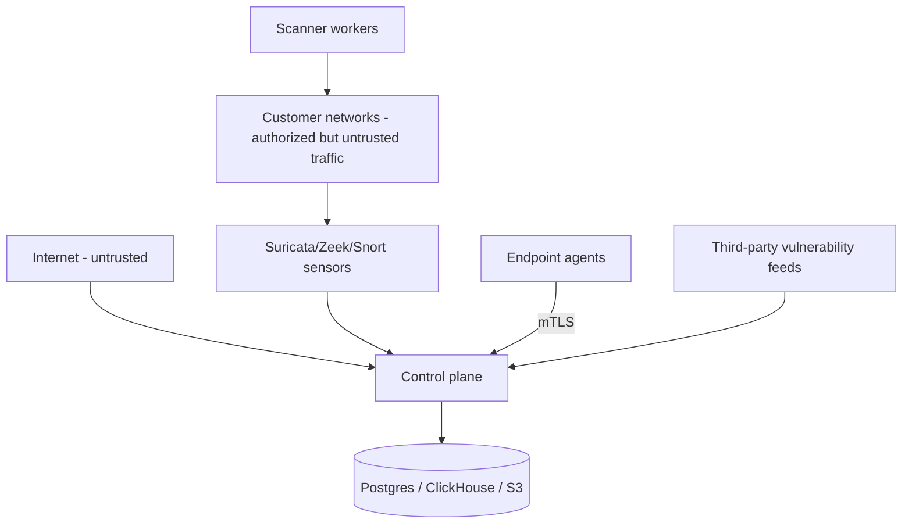

# Threat model

## Trust boundaries

Network placement never equals trust: events from sensors, inventory from agents and records from feeds are all untrusted input.

## Threats & mitigations

| Threat | Actor | Mitigation |
|---|---|---|
| Command injection via scan config | API client/insider | typed config → argument arrays; no shell; validated targets |
| SSRF via hostnames | API client | hostname screening; localhost/metadata/link-local rejection |
| Tenant breakout | authenticated user | tenant column in every query; token-bound org; isolation tests |
| Agent impersonation | external attacker | one-time enrollment tokens (hashed), CSR-signed device certs, revocable |
| Scanner abuse (scan beyond scope) | malicious insider | scope validation + ceilings, profile gating, elevated confirmation + audit, kill switch |
| Credential theft | compromised endpoint | agent never collects passwords/secrets; redaction on banners |
| Event poisoning | compromised sensor | schema validation, payload caps, dedup windows; raw preserved for forensics |
| Malicious feed record | upstream compromise | feeds are untrusted: schema/size validation, no execution of feed content, provenance retained |
| Nuclei/NSE code execution via templates | attacker-supplied content | only bundled/administratively-approved sources; safe NSE category only |
| DoS on API | external | rate limits, body caps, timeouts, pagination floors |
| Data exfiltration via reports | insider | tenant-scoped reports, presigned short-lived URLs, audit trail |
| Privilege escalation in deployment | external | non-root containers, minimal capabilities, no privileged mode by default |

## Residual risks (documented)

- Agent transport currently terminates TLS at the LB in containerized deployments; local dev runs plaintext gRPC with an explicit warning.
- Windows/macOS collectors are best-effort (stdlib basics) until native API integrations land.
- OSV full-ecosystem bootstrap is deferred in favor of package-scoped matching.
